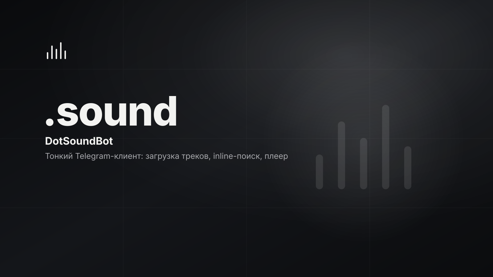

# .sound

<p>
  
  
  
  <!-- loc:start --><!-- loc:end -->
</p>



<!-- audit:start -->
<p>
  
  
  
  
  
</p>
<!-- audit:end -->

Тонкий Telegram-клиент музыкальной платформы DotSound на aiogram 3. Хендлеры не содержат бизнес-логики - только вызовы бэкенда через единственный HTTP-клиент, а чувствительная bridge-логика и internal-контракты вынесены в закрытый пакет `dotsound_private_core`. Source-available showcase: код открыт для чтения и оценки, для полного локального запуска нужен соседний приватный пакет.

## Что внутри

- **Inline-плеер.** Листание треков пачками с предзагрузкой (prefetch), 6 источников (мои, лайки, лента, плейлисты, подписки, рекомендации), shuffle и кнопка «назад»; `file_id` кэшируется в Redis.
- **Загрузка треков.** Аудиофайлы (`.mp3`, `.flac`, `.ogg`, `.wav`, `.m4a`), отправленные в чат, автоматически уходят на платформу.
- **Inline-поиск.** Поиск треков из любого чата через `@bot запрос`, без открытия бота.
- **Mini App.** Кнопка меню `.sound` открывает веб-плеер внутри Telegram.
- **Веб-вход.** Коды авторизации и уведомления о входе доставляются через бота.
- **Команды и UX.** `/start`, `/help`, `/mystats`, лайки, рекомендации, артисты, плейлисты.
- **Два языка.** Русский и английский, выбор по `language_code` пользователя.
- **Internal API.** Закрытый aiohttp-эндпоинт на loopback (`:8081`) для обратных вызовов бэкенд → бот, защищён заголовком `X-Internal-Secret`.

## Запуск

Полный запуск рассчитан на владельцев DotSound-workspace - рядом должен лежать приватный `../DotSoundPrivateCore`, а бот - тонкий клиент и не работает без запущенного DotSoundBackend.

```bash
poetry install            # требует соседний ../DotSoundPrivateCore
cp .env.example .env       # заполнить BOT_TOKEN, BACKEND_BASE_URL, MINI_APP_URL
poetry run python main.py  # long polling + internal API на :8081
```

Токен бота - у [@BotFather](https://t.me/BotFather) (`/newbot`), inline-режим включается там же (`Bot Settings → Inline Mode`). Публичный showcase-клон без приватного пакета предназначен для code review, а не для production-запуска.

### Docker

```bash
docker compose up -d --build   # bot + redis, json-file log rotation
```

Образ собирается из родительского контекста, включающего оба репозитория (`DotSoundBot` и `DotSoundPrivateCore`) - см. комментарий в `Dockerfile`.

## Команды

| Команда | Назначение |
|---------|------------|
| `poetry run python main.py` | Запуск бота (long polling + internal API) |
| `poetry run pytest` | Тесты (pytest + anyio) |
| `poetry run pytest --cov=bot` | Покрытие (branch, порог 80%) |
| `poetry run ruff check .` | Линтер |
| `poetry run black .` | Форматирование (79 символов) |
| `poetry run mypy bot/` | Проверка типов (strict) |
| `python scripts/check_boundary_policy.py` | Guardrail public/private границы |
| `docker compose up -d --build` | bot + redis |

## Стек

<p>
  
  
  
  
  
  
  
  
  
  
  
  
</p>

## Тесты

```bash
poetry run pytest
poetry run pytest --cov=bot --cov-report=term-missing
```

Async-тесты на `pytest` + `anyio`, branch-coverage с порогом 80% (`fail_under`). Маркеры `s3`, `redis`, `slow` помечают интеграционные тесты.

## Архитектура

Тонкий слой над DotSoundBackend. Хендлеры aiogram вызывают единственный `BackendClient` (httpx) и формируют ответ; бизнес-логики в них нет. Чувствительная bridge-логика и internal-контракты живут в закрытом `dotsound_private_core` и не инлайнятся в публичный код. Внутренний aiohttp-API слушает только loopback и принимает обратные вызовы бэкенда (скачивание аудио, коды входа, админ-алерты). Redis хранит `file_id`-кэш и сессии плеера.

```
DotSoundBot/
├── bot/
│   ├── main.py              # Bot + Dispatcher, polling, internal API, меню Mini App
│   ├── config.py            # BotSettings (pydantic-settings), валидатор loopback-bind
│   ├── api/
│   │   ├── client.py        # BackendClient - единственный канал к бэкенду
│   │   └── internal.py      # aiohttp internal API (loopback, X-Internal-Secret)
│   ├── handlers/            # base, audio, inline_mode, likes, player, playlists,
│   │   │                    #   recommendations, artists, stats, web_auth (тонкие)
│   ├── keyboards/           # фабрики InlineKeyboardMarkup
│   ├── middlewares/         # logging, throttling (rate limit)
│   ├── services/            # file_id_cache (Redis), player_session
│   ├── core/                # structlog logging
│   ├── i18n/                # каталог строк ru/en
│   └── utils/               # formatting
├── scripts/                 # check_boundary_policy, check_branch_coverage
├── tests/                   # pytest + anyio, зеркало структуры bot/
├── docs/                    # boundary policy, private-core dependency policy
├── docker-compose.yml       # bot + redis
└── Dockerfile               # multi-stage, parent-context build
```

- **Тонкие хендлеры**: только `BackendClient` и ответ пользователю, без прямого `httpx`
- **Единый канал**: все запросы к бэкенду - через `bot/api/client.py`
- **Public/private граница**: bridge-логика и контракты - в `dotsound_private_core`, не в public-коде (CI `check_boundary_policy.py`)
- **Internal API только loopback**: `config.py` валидирует bind-адрес, наружу не публикуется
- **Конфиг через `bot/config.py`**: `os.environ` напрямую запрещён
- **Тесты на каждую фичу**: branch-coverage не ниже 80%

## Лицензия

© 2026 DotSound. Source-available, не open source.

Код открыт для чтения, архитектурного и security-review и локальной не-production оценки. Production-использование, коммерция, SaaS-хостинг, redistribution и производные продукты запрещены без письменного разрешения. Приватный пакет `DotSoundPrivateCore` намеренно не публикуется. См. [LICENSE](LICENSE) и [NOTICE](NOTICE).
